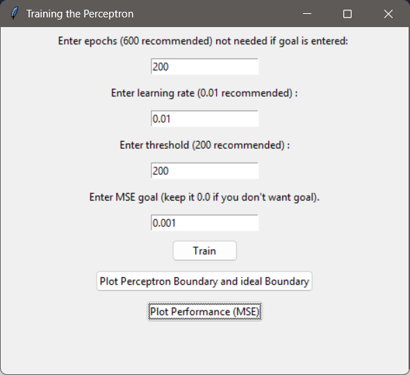
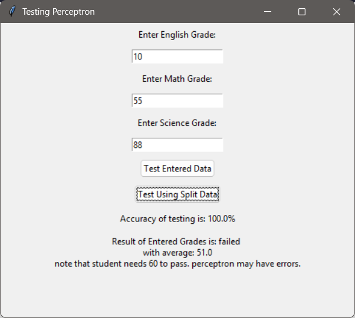
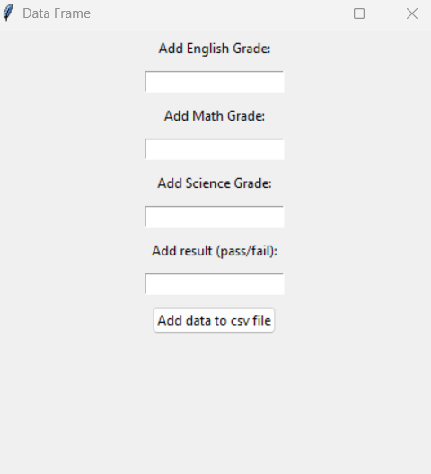
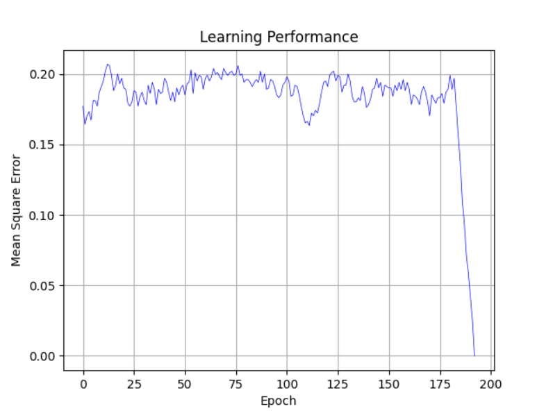
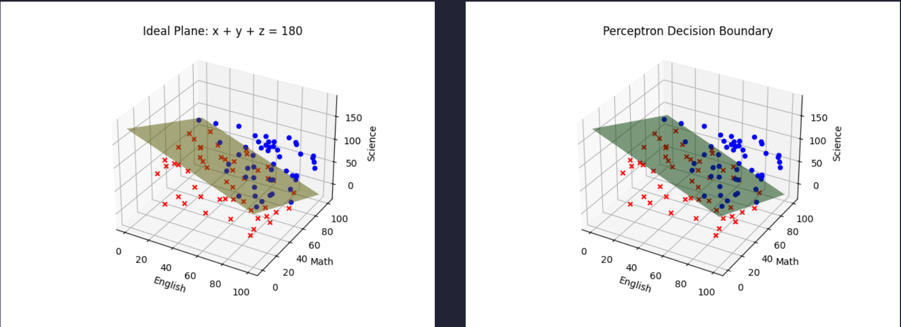
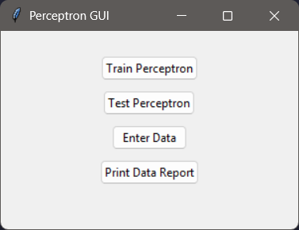

# Perceptron-Grade-Learning

A binary classification model built from scratch using a single-layer perceptron to classify student grades as "pass" or "fail" based on the plane equation `x + y + z = 180`. This project demonstrates the implementation of a basic perceptron model with gradient descent learning, visualizing the decision boundary, and providing a user-friendly GUI interface for interaction.

## Table of Contents
- [Project Overview](#project-overview)
- [Mathematical Foundation](#mathematical-foundation)
- [Implementation Details](#implementation-details)
  - [Perceptron from Scratch](#perceptron-from-scratch)
  - [Gradient Descent Algorithm](#gradient-descent-algorithm)
  - [Data Generation](#data-generation)
- [GUI Interface](#gui-interface)
- [Features](#features)
- [Files in the Project](#files-in-the-project)
- [Usage Guide](#usage-guide)
- [Results and Visualizations](#results-and-visualizations)
- [Technical Requirements](#technical-requirements)

## Project Overview

This project implements a single-layer perceptron neural network that classifies students as "pass" or "fail" based on their grades in three subjects: English, Math, and Science. The classification is based on the plane equation `x + y + z = 180`, meaning:
- If the sum of the three grades is greater than or equal to 180, the student passes
- If the sum is less than 180, the student fails

The perceptron learns this decision boundary through supervised learning with gradient descent, and the project provides tools to visualize the learned boundary compared to the ideal boundary.

## Mathematical Foundation

The perceptron model implements the following mathematical operations:

1. **Linear Combination**: `net = w1*x1 + w2*x2 + w3*x3 + b`
   - Where `w1, w2, w3` are weights for each subject grade
   - `x1, x2, x3` are the input grades
   - `b` is the bias term (implemented as threshold)

2. **Activation Function**: Unit Step Function
   ```python
   def unit_step(x, epsilon=1e-5):
       if abs(x) < epsilon:
           x = 0.0
       return 1 if x >= 0 else 0
   ```

3. **Learning Rule**: Gradient Descent
   ```python
   error = desired_output - actual_output
   delta_w = error * learning_rate * input_value
   weights += delta_w
   ```

4. **Performance Metric**: Mean Squared Error (MSE)
   ```python
   mse = total_error / num_samples
   ```

## Implementation Details

### Perceptron from Scratch

The perceptron is implemented from scratch in the `perceptron.py` file. Key components include:

- **Weight Initialization**: Random weights between 0.3 and 0.8 for better convergence
- **Bias Term**: Implemented as part of the weight vector with a negative threshold value
- **Learning Process**: Implemented with configurable parameters:
  - Learning rate (default: 0.01)
  - Number of epochs (default: 250)
  - MSE goal (optional stopping criterion)

### Gradient Descent Algorithm

The training function implements gradient descent by:

1. Initializing weights randomly
2. For each epoch:
   - Calculating the output for each training sample
   - Computing the error between desired and actual output
   - Updating weights based on the error and learning rate
   - Calculating MSE for monitoring performance
3. Continuing until either:
   - Maximum epochs are reached, or
   - MSE goal is achieved consistently for 10 consecutive epochs

```python
# Key gradient descent code snippet
for j in range(self.X_train.shape[0]):
    bigX = np.dot(self.X_train[j], self.weights)
    self.Ya_train[j] = unit_step(bigX)
    error = self.Yd_train[j] - self.Ya_train[j]
    total_error += error ** 2
    delta_w = error * self.learning_rate * self.X_train[j]
    self.weights += delta_w
```

### Data Generation

The project includes a C program (`data_generation.c`) that generates balanced pass/fail data points:

- Creates 50 data entries for training and testing
- Ensures a 1:1 pass-to-fail ratio for better model training
- Generates random grades between 0-100 for each subject
- Uses the plane equation to determine the correct classification

## GUI Interface

The project features a fully interactive GUI built with Tkinter that allows users to:

1. **Train the perceptron** with configurable parameters
   

2. **Test the model** with split data or user-entered values
   

3. **Enter new data** to expand the dataset
   

4. **Generate reports** of test results

5. **Visualize performance** through MSE plots and decision boundary visualization
   
   

## Features

- **Training with custom parameters**: Epochs, learning rate, threshold, and MSE goal
- **Data splitting**: Automatic train-test split (default 80-20)
- **Performance visualization**: MSE plots to track learning progress
- **Decision boundary visualization**: 3D plots comparing learned vs. ideal boundaries
- **Testing interface**: Test with split data or user-entered values
- **Data entry**: Add new records to the dataset through the GUI
- **PDF Report generation**: Create formatted reports of test results

## Files in the Project

1. **perceptron.py**: Core perceptron implementation with training, testing, and visualization functions
2. **main.py**: GUI implementation using Tkinter
3. **data_generation.c**: C program for generating balanced training data
4. **passfail.csv**: Dataset containing student grades and pass/fail classifications
5. **report.pdf**: Generated test results in PDF format
6. **img/**: Directory containing visualization screenshots

## Usage Guide

1. **Start the application**:
   ```
   python main.py
   ```

2. **Training the perceptron**:
   - Click "Train Perceptron"
   - Enter desired parameters (or use recommended defaults)
   - Click "Train"
   - View results with "Plot Performance" or "Plot Perceptron Boundary"

3. **Testing the model**:
   - Click "Test Perceptron"
   - Either enter grades manually or test with split data
   - View accuracy results

4. **Adding new data**:
   - Click "Enter Data"
   - Input grades and classification
   - Click "Add data to csv file"

5. **Generating reports**:
   - Click "Print Data Report"
   - A PDF report will be generated with test results

## Results and Visualizations

The model visualizes two important aspects:

1. **Learning Performance**: MSE over epochs showing convergence
   

2. **Decision Boundary Comparison**:
   - Green surface: Perceptron's learned decision boundary
   - Yellow surface: Ideal boundary (x + y + z = 180)
   - Blue points: Passed students
   - Red points: Failed students
   

3. **Data Selection and Testing**:
   

## Technical Requirements

- Python 3.x
- Required Python libraries:
  - NumPy
  - Pandas
  - Matplotlib
  - Tkinter
  - ReportLab (for PDF generation)
- GCC compiler (for building the data generation program)
